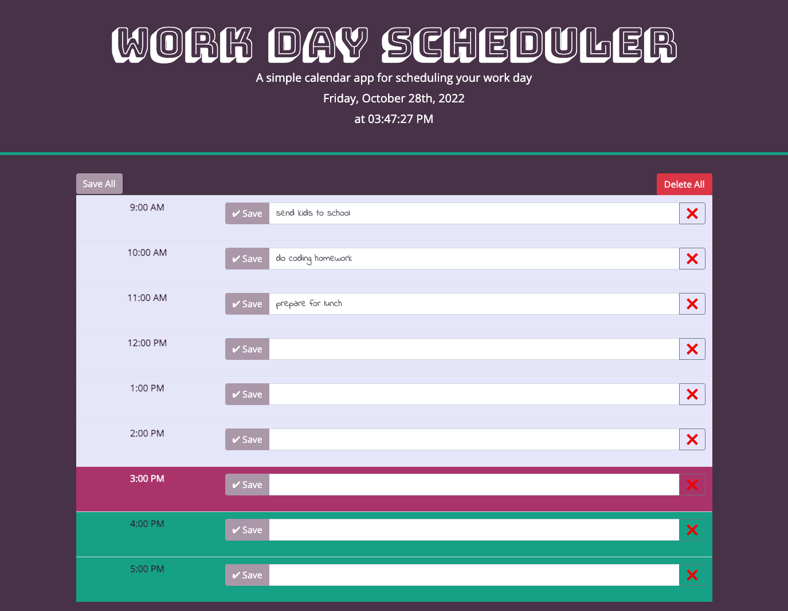

# Module-5-Challenge-Work-Day-Scheduler
A simple calendar application that allows a user to save events for each hour of the day. What's in your calendar?

HTML, CSS, JS with MomentJS and Google Fonts are employed to build this page.

## Table of Contents
1. [Deployed Page](#deployed-page)
2. [Web Application Features](#web-application-features)

## Deployed Page

[Work Day Scheduler](https://iwirsing.github.io/Module-5-Challenge-Work-Day-Scheduler/) 

## Web Application Features

1. Current day and time using momentJS are displayed on the top of the page. The time is checked every second.
2. Google fonts of Bungee Shade and Indie Flower are used to add to the design.
3. The time blocks change depending on whether it is in the past, present or future.
4. A save button (&#10004; Save) saves the todo input of the user to the local storage.
5. A delete button (&#10060;) deletes the time block's todo data off the local storage.

## Screenshot

## 
